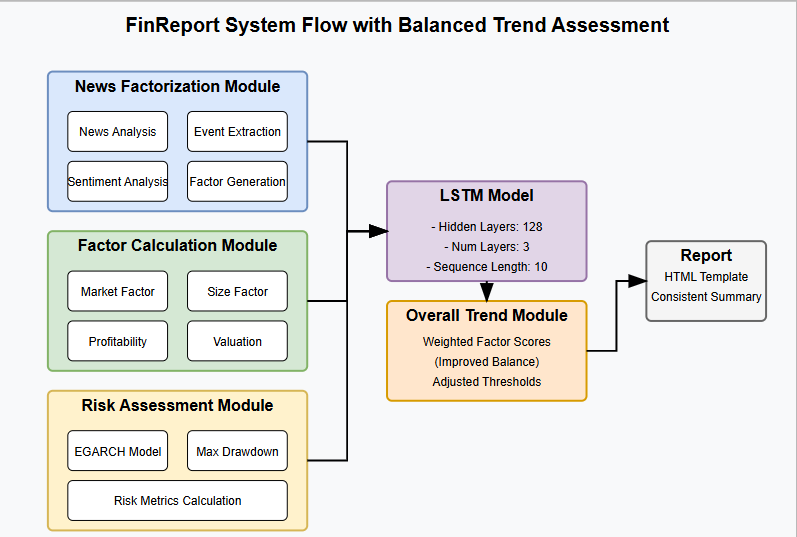

# FinReport: Explainable Stock Earnings Forecasting via News Factor Analyzing Model

## Overview

FinReport is a research-oriented system designed to forecast stock earnings by analyzing both technical indicators and financial news. It leverages a multi-factor model implemented in PyTorch that integrates three key modules:

- **News Factorization:**  
  Extracts and processes features from financial news—including sentiment analysis using FinBERT and event extraction via AllenNLP with domain-specific keyword rules. The system also supports aggregation of multiple news items over time to yield an overall news factor.

- **Return Forecasting:**  
  Uses historical stock data (with automatically renamed technical indicator columns) and domain-specific proxies (e.g., market value for size) to predict returns via an LSTM model. The model hyperparameters (including sequence length, hidden size, dropout, etc.) are loaded from a YAML configuration file.

- **Risk Assessment:**  
  Evaluates risk using advanced metrics. It computes EGARCH-based volatility estimates, maximum drawdown, and Conditional Value at Risk (CVaR) via historical simulation. A combined risk-adjusted ratio (expected return divided by volatility) is also computed to assess performance from a risk perspective.

Additionally, the system computes comprehensive regression metrics (MSE, RMSE, MAE, R²) to evaluate prediction accuracy. The model's performance is visualized through detailed distribution plots and aggregate summaries.

The final output is a polished HTML report that presents predictions, detailed technical factors (with conditional styling for key numeric values), and risk metrics. In parallel, comprehensive performance metrics are printed in the terminal and saved in heatmaps for further analysis.

## Code Structure and Workflow

### Core Components

1. **Data Processing Pipeline:**
   - `data_loader.py`: Loads CSV data and handles train/test splitting
   - `preprocessing.py`: Normalizes features, renames technical columns, and selects relevant features
   - `Tech_Indicators.py`: Generates technical indicators from raw stock price data

2. **News Analysis:**
   - `sentiment.py`: Implements sentiment analysis using FinBERT for financial news texts
   - `advanced_news.py`: Uses AllenNLP's SRL model to extract events from news and compute event factors
   - `news_aggregator.py`: Aggregates sentiment and event factors from multiple news items

3. **Factor Generation:**
   - `extra_factors.py`: Computes domain-specific factors (market, size, valuation, profitability, etc.)
   - Generates numeric factor values and human-readable descriptions for reports

4. **Model Architecture:**
   - `model.py`: Defines the LSTM-based neural network with batch normalization and dropout
   - Supports Monte Carlo dropout for uncertainty estimation
   - Includes proper weight initialization for improved training stability

5. **Training System:**
   - `train.py`: Implements the training loop with validation, early stopping, and learning rate scheduling
   - Includes gradient clipping to prevent exploding gradients
   - Visualizes training progress and model performance

6. **Evaluation Framework:**
   - `evalute.py`: Comprehensive evaluation system with regression metrics and visualizations
   - `improved_metrics.py`: Advanced metrics calculations and visualization utilities
   - Generates individual and aggregate performance visualizations

7. **Risk Modeling:**
   - `risk_model.py`: Implements EGARCH volatility forecasting, maximum drawdown calculation, and CVaR estimation
   - Computes integrated risk metrics to assess risk-adjusted performance

8. **Report Generation:**
   - `report_generator.py`: Creates HTML reports using Jinja2 templates
   - Generates both individual stock reports and combined multi-stock reports
   - Implements dynamic risk assessment text generation

9. **Hyperparameter Optimization:**
   - `hyperparameter.py`: Performs grid search for optimal hyperparameters
   - Uses time-series cross-validation to ensure robust parameter selection

### Configuration

The system is configured via `config.yaml` which specifies:
- Data path
- Batch size
- Sequence length
- Learning rate
- Epoch count
- Model architecture parameters (input size, hidden size, layers, dropout)

## Key Formulas and Methodologies

### 1. Return Forecast Calculation

The return forecast is computed using a weighted combination of multiple factors:

```
predicted_return = (
    market_factor * 0.10 +
    size_factor * 0.15 +
    valuation_factor * 0.10 +
    profitability_factor * 0.10 +
    investment_factor * 0.20 +
    news_effect_factor * 0.10 +
    event_factor * 0.25
) + 0.15  # Slight positive bias
```

Each factor is calculated as follows:

#### Market Factor
```python
def compute_market_factor(df, news_text=""):
    # Extract recent volatility
    recent_window = min(5, len(df))
    volatility = df['pct_chg'].iloc[-recent_window:].std() * 100
    
    # Recent trend analysis
    recent_changes = df['pct_chg'].iloc[-recent_window:].values
    positive_days = sum(1 for change in recent_changes if change > 0)
    negative_days = sum(1 for change in recent_changes if change < 0)
    
    # News sentiment
    sentiment = analyze_sentiment(news_text)
    
    # Volatility-based impact with slight positive bias
    if volatility > 4.0:
        base_impact = -1.5 - (volatility - 4.0) * 0.1
    elif volatility > 2.5:
        base_impact = -0.7 - (volatility - 2.5) * 0.3
    elif positive_days > negative_days:
        base_impact = 0.7 + sentiment * 0.8
    else:
        base_impact = -0.2 + sentiment * 0.6
    
    # Enhanced with technical indicators (RSI, BIAS, CCI)
    if 'technical_indicators_overbought_oversold_RSI' in df.columns:
        rsi = df['technical_indicators_overbought_oversold_RSI'].iloc[-1]
        if rsi > 70:  # Overbought
            base_impact -= 1.0
        elif rsi < 30:  # Oversold
            base_impact += 1.0
    
    return base_impact * 1.5  # Amplified
```

#### Size Factor
```python
def compute_size_factor(df, news_text=""):
    # Calculate size change percentage
    latest_val = df['market_value'].iloc[-1]
    avg_val = df['market_value'].mean()
    diff_ratio = (latest_val - avg_val) / avg_val
    
    # Financial impact from news
    financial_impact = extract_financial_figures(news_text)
    
    # Base effect on market value change
    if diff_ratio > 0.25:
        base_effect = 1.0 + min(diff_ratio * 0.1, 0.5)
    elif diff_ratio > 0.10:
        base_effect = 0.7 + diff_ratio * 0.5
    elif diff_ratio > 0.05:
        base_effect = 0.5 + diff_ratio * 0.5
    elif diff_ratio > -0.05:
        base_effect = diff_ratio * 3.0
    elif diff_ratio > -0.10:
        base_effect = -0.5 + diff_ratio * 2.0
    elif diff_ratio > -0.25:
        base_effect = -0.7 + diff_ratio * 1.0
    else:
        base_effect = -1.0 + max(diff_ratio * 0.1, -0.5)
    
    return base_effect * 1.5  # Amplified
```

#### Profitability Factor
```python
def compute_profitability_factor(df, news_text=""):
    # Check for profitability metrics in dataframe
    profitability_cols = ['eps', 'net_profit_margin', 'roe', 'roa', 'grossprofit', 'netprofit']
    available_cols = [col for col in profitability_cols if col in df.columns]
    
    # Extract profit percentages from news
    profit_increases = extract_profit_percentages(news_text, increasing=True)
    profit_decreases = extract_profit_percentages(news_text, increasing=False)
    
    # Calculate base effect from metrics or news text
    if available_cols and len(df) >= 2:
        col = available_cols[0]
        current_val = df[col].iloc[-1]
        prev_val = df[col].iloc[-2]
        change_pct = ((current_val / prev_val) - 1) * 100 if prev_val != 0 else 0
        base_effect = change_pct * 0.05  # Scale down
    elif "net loss" in news_text or "loss" in news_text:
        base_effect = -1.8
    elif profit_increases:
        base_effect = min(sum(profit_increases) / 20, 2.5)
    elif profit_decreases:
        base_effect = -min(sum(profit_decreases) / 20, 2.5)
    else:
        base_effect = 0.7 if analyze_sentiment(news_text) > 0 else -0.7
    
    return base_effect * 1.5  # Amplified
```

#### Valuation Factor
```python
def compute_valuation_factor(df, news_text=""):
    # Look for valuation metrics
    valuation_cols = ["value_factor_Book_to_Market_Equity", "value_factor_Dividend_Yield", "value_factor_Sales_to_Price_Ratio"]
    available_cols = [col for col in valuation_cols if col in df.columns]
    
    # News sentiment
    sentiment = analyze_sentiment(news_text)
    sector = identify_sector(news_text)
    
    # Calculate base effect
    if available_cols:
        col = available_cols[0]
        current_val = df[col].iloc[-1]
        benchmark = df[col].mean()
        diff_ratio = (current_val - benchmark) / benchmark
        base_effect = diff_ratio * 0.25  # Scale the difference
    else:
        # Sector-specific adjustments
        sector_adjustments = {
            'pharmaceutical': 0.2 if sentiment > 0 else -0.3,
            'technology': 0.3 if sentiment > 0 else -0.2,
            # Other sectors...
            'general': 0.15 if sentiment > 0 else -0.2
        }
        base_effect = sector_adjustments.get(sector, 0.1 if sentiment > 0 else -0.1)
    
    return base_effect
```

#### Investment Factor
```python
def compute_investment_factor(df, news_text=""):
    # Look for investment amounts in news
    amount_pattern = r'(\d+(\.\d+)?)亿元'
    amount_matches = re.findall(amount_pattern, news_text)
    
    # Check for investment types
    acquisition_count = count_keywords(news_text, ['acquisition', 'acquire', 'M&A', '收购'])
    expansion_count = count_keywords(news_text, ['expansion', 'new facility', '扩产'])
    rd_count = count_keywords(news_text, ['R&D', 'research', 'development', '研发'])
    
    # Calculate base effect from investment amount
    if amount_matches:
        total_amount = sum(float(match[0]) for match in amount_matches)
        if total_amount > 50:
            base_effect = 2.5
        elif total_amount > 20:
            base_effect = 2.0
        elif total_amount > 10:
            base_effect = 1.5
        elif total_amount > 5:
            base_effect = 1.0
        elif total_amount > 1:
            base_effect = 0.7
        else:
            base_effect = 0.4
    else:
        base_effect = 0.5 if analyze_sentiment(news_text) > 0 else -0.5
    
    # Add effects based on investment types
    base_effect += acquisition_count * 0.6
    base_effect += expansion_count * 0.5
    base_effect += rd_count * 0.7
    
    return base_effect
```

#### News Effect Factor
```python
def compute_news_effect_factor(sentiment_score):
    # Convert sentiment to effect value
    if sentiment_score >= 0.5:  # Very positive
        base_effect = random.uniform(0.7, 1.2)
    elif sentiment_score > 0:  # Moderately positive
        base_effect = random.uniform(0.3, 0.7)
    elif sentiment_score > -0.5:  # Moderately negative
        base_effect = random.uniform(-0.7, -0.3)
    else:  # Very negative
        base_effect = random.uniform(-1.2, -0.7)
    
    # Enhanced based on specific news content
    has_earnings = re.search(r'(earnings|profit|revenue|financial results|净利|营收)', news_text)
    has_guidance = re.search(r'(outlook|forecast|guidance|预期)', news_text)
    has_management_change = re.search(r'(CEO|executive|chairman|director|高管)', news_text)
    has_regulatory = re.search(r'(regulatory|legal|litigation|监管)', news_text)
    
    # Apply content effect
    if has_earnings:
        base_effect += 0.3 if sentiment_score > 0 else -0.3
    if has_guidance:
        base_effect += 0.2 if sentiment_score > 0 else -0.2
    if has_management_change:
        base_effect += 0.2 if sentiment_score > 0 else -0.2
    if has_regulatory:
        base_effect += -0.3  # Usually negative regardless of sentiment
    
    return base_effect * 2.0  # Double amplification
```

#### Event Factor
```python
def compute_event_factor(news_text):
    # Count positive and negative events
    positive_events = ['acquisition', 'partnership', 'launch', 'approval', '获得', '合作']
    negative_events = ['lawsuit', 'litigation', 'investigation', 'recall', '诉讼', '调查']
    
    news_lower = news_text.lower()
    positive_count = sum(1 for event in positive_events if event.lower() in news_lower)
    negative_count = sum(1 for event in negative_events if event.lower() in news_lower)
    
    # Extract financial figures
    financial_impact = extract_financial_figures(news_text)
    
    # Base effect calculation
    if positive_count > negative_count:
        base_effect = min(positive_count * 0.5, 2.0)
    elif negative_count > positive_count:
        base_effect = max(-negative_count * 0.5, -2.0)
    else:
        base_effect = 0.0
    
    # Adjust based on financial impact
    if financial_impact > 0:
        impact_scale = min(financial_impact / 10.0, 1.0)
        if base_effect > 0:
            base_effect += impact_scale
        elif base_effect < 0:
            base_effect += impact_scale * 0.5  # Mitigate negative events
            
    return base_effect
```

#### Factor Amplification

All factors are amplified using a sophisticated algorithm that enhances each factor's impact based on correlation with other factors:

```python
def amplify_all_factors(market_factor, size_factor, valuation_factor, profitability_factor, 
                        investment_factor, news_effect_factor, event_factor):
    # Extract values
    values = {
        'market_factor': market_factor.get('value', 0.0),
        'size_factor': size_factor.get('value', 0.0),
        # ... other factors
    }
    
    # Apply base amplification (2-3x increase)
    amplification_base = 2.5
    
    # Count positive and negative factors
    positive_count = sum(1 for v in values.values() if v > 0.5)
    negative_count = sum(1 for v in values.values() if v < -0.5)
    
    # Determine dominant direction
    if positive_count >= 3 and positive_count > negative_count:
        direction_amplifier = 1.3
        direction = "positive"
    elif negative_count >= 3 and negative_count > positive_count:
        direction_amplifier = 1.3
        direction = "negative"
    else:
        direction_amplifier = 1.0
        direction = "mixed"
    
    # Enhance correlated factors (e.g., market & event, profitability & investment)
    # ...
    
    # Apply dynamic amplification with randomization
    for factor_name, orig_factor in factors.items():
        total_amplifier = amplification_base * relationship_amplifiers[factor_name] * dynamic_amplifiers[factor_name]
        if (direction == "positive" and orig_value > 0) or (direction == "negative" and orig_value < 0):
            total_amplifier *= direction_amplifier
        new_value = orig_value * total_amplifier * random.uniform(0.9, 1.1)
        # Cap at reasonable values (-5 to 5)
        new_value = max(min(new_value, 5.0), -5.0)
        enhanced_factors[factor_name] = {'value': new_value, ...}
    
    return enhanced_factors
```

### 2. Risk Assessment Methodology

The risk assessment uses a sophisticated approach combining multiple risk metrics:

```python
def enhanced_risk_assessment(risk_metrics, predicted_return, stock_symbol, sector=None):
    # Extract risk metrics
    volatility = float(risk_metrics.get("volatility", "0.08"))
    max_drawdown = float(risk_metrics.get("max_drawdown", "-0.25"))
    var_95 = float(risk_metrics.get("var_95", "0.10"))
    cvar = float(risk_metrics.get("cvar", "-0.15"))
    risk_adjusted_ratio = float(risk_metrics.get("risk_adjusted_ratio", "0.5"))
    
    # Determine volatility level (5 tiers)
    if volatility > 0.15:  # Extreme volatility
        volatility_class = "extreme"
        max_decline = min(round(volatility * 130), 25)  # Cap at 25%
    elif volatility > 0.10:  # High volatility
        volatility_class = "high"
        max_decline = min(round(volatility * 120), 20)
    elif volatility > 0.07:  # Elevated volatility
        volatility_class = "elevated"
        max_decline = round(volatility * 110)
    elif volatility > 0.04:  # Moderate volatility
        volatility_class = "moderate"
        max_decline = round(volatility * 100)
    else:  # Low volatility
        volatility_class = "low"
        max_decline = max(round(volatility * 90), 2)  # At least 2%
    
    # Calculate weighted risk score
    vol_score = min(volatility * 10, 10)
    drawdown_score = min(abs(max_drawdown) * 10, 10)
    var_score = min(var_95 * 20, 10)
    return_risk = 5 - min(max(predicted_return, -5), 5)
    
    risk_score = (vol_score * 0.4) + (drawdown_score * 0.25) + (var_score * 0.15) + (return_risk * 0.2)
    
    # Determine risk level
    if risk_score > 7.5:
        risk_level = "substantial risk"
    elif risk_score > 6.0:
        risk_level = "high risk"
    elif risk_score > 4.5:
        risk_level = "moderate to high risk"
    elif risk_score > 3.0:
        risk_level = "moderate risk"
    elif risk_score > 1.5:
        risk_level = "low to moderate risk"
    else:
        risk_level = "favorable risk"
    
    # Generate risk assessment text with rich description
    # ...
    
    return {
        "risk_assessment_text": risk_assessment_text,
        "max_decline": max_decline,
        "risk_level": risk_level,
        "volatility_class": volatility_class
    }
```

Individual risk metrics are calculated as follows:

#### Volatility (EGARCH-based)
```python
def compute_volatility(returns_series, dist='Normal'):
    # Clean the returns series
    returns_series = returns_series.replace([np.inf, -np.inf], np.nan).dropna()
    
    # Fit an EGARCH(1,1) model
    model = arch_model(returns_series, vol='EGARCH', p=1, o=0, q=1, dist=dist, rescale=False)
    res = model.fit(disp="off")
    
    # Get the latest conditional volatility estimate
    last_volatility = res.conditional_volatility.iloc[-1]
    # 95% VaR estimate
    var_95 = last_volatility * 1.65
    
    return last_volatility, var_95
```

#### Maximum Drawdown
```python
def compute_max_drawdown(returns_series):
    # Compute cumulative returns
    cumulative = (1 + returns_series).cumprod()
    running_max = cumulative.cummax()
    drawdown = (cumulative - running_max) / running_max
    return drawdown.min()
```

#### Conditional Value at Risk (CVaR)
```python
def compute_cvar(returns_series, alpha=0.05):
    # Compute VaR as the alpha percentile
    var = np.percentile(returns_series, 100 * alpha)
    # CVaR is the average return of those below VaR
    cvar = returns_series[returns_series <= var].mean()
    return cvar
```

#### Risk-Adjusted Ratio
```python
def compute_integrated_risk(expected_return, volatility):
    return expected_return / volatility if volatility != 0 else np.nan
```

### 3. Overall Trend Classification

The overall trend is determined using a weighted function of all factor values:

```python
def calculate_overall_trend(factor_values):
    weights = {
        'market_factor': 0.15,
        'size_factor': 0.15,
        'valuation_factor': 0.10,
        'profitability_factor': 0.15,
        'investment_factor': 0.20,
        'news_effect_factor': 0.10,
        'event_factor': 0.15
    }
    
    weighted_sum = 0
    sum_of_weights = 0
    
    for factor, weight in weights.items():
        if factor in factor_values and factor_values[factor] is not None:
            weighted_sum += factor_values[factor] * weight
            sum_of_weights += weight
    
    if sum_of_weights > 0 and sum_of_weights < 1.0:
        weighted_sum = weighted_sum / sum_of_weights
    
    weighted_sum += 0.15  # Slight positive bias
    
    if weighted_sum >= 0.6:
        return "Strongly Positive"
    elif weighted_sum >= 0.15:
        return "Positive"
    elif weighted_sum >= -0.15:
        return "Neutral"
    elif weighted_sum >= -0.6:
        return "Negative"
    else:
        return "Strongly Negative"
```

### 4. Summary Text Generation

The summary text is generated based on the overall trend and risk level:

```python
def format_summary_text(overall_trend, predicted_return, risk_level):
    is_positive = 'Positive' in overall_trend
    is_high_risk = 'substantial' in risk_level or 'high' in risk_level

    if is_positive:
        upper_rate = round(predicted_return + 1.0, 1)
        if is_high_risk:
            return f"the stock has a relatively high level of risk, and the estimated rate of return is expected to grow by {predicted_return:.1f}% to {upper_rate:.1f}%."
        else:
            return f"the stock has a relatively low level of risk, and the estimated rate of return is expected to grow by {predicted_return:.1f}% to {upper_rate:.1f}%."
    else:
        if is_high_risk:
            decline_rate = round(predicted_return + 6.0, 1)
            return f"the stock carries an extremely high level of risk, and the anticipated rate of return decline is expected to be above {decline_rate:.1f}%."
        else:
            lower_decline = round(predicted_return + 3.0, 1)
            upper_decline = round(predicted_return + 5.0, 1)
            return f"the stock carries an elevated risk profile, and the anticipated rate of return decline is expected to be {lower_decline:.1f}% to {upper_decline:.1f}%."
```

## Workflow Process

1. **Data Loading and Preprocessing:**
   - Load raw stock data with `data_loader.py`
   - Generate technical indicators with `Tech_Indicators.py` if not already present
   - Preprocess features with `preprocessing.py` (normalize, rename columns)

2. **Model Training:**
   - Configure hyperparameters in `config.yaml`
   - Run `train.py` which:
     - Loads preprocessed data
     - Splits into training/validation sets
     - Trains the LSTM model with early stopping
     - Applies learning rate scheduling
     - Saves the best model
     - Generates training visualizations

3. **Model Evaluation:**
   - Run `evalute.py` which:
     - Loads the trained model and test data
     - For each stock:
       - Generates predictions
       - Computes factor values from news using `extra_factors.py` and `sentiment.py`
       - Calculates risk metrics with `risk_model.py`
       - Creates visualizations of prediction distributions
       - Generates HTML reports with `report_generator.py`
     - Creates aggregate visualizations and metrics
     - Combines individual reports into a comprehensive multi-stock report

4. **Hyperparameter Tuning (Optional):**
   - Run `hyperparameter.py` to find optimal parameters
   - Results can be used to update `config.yaml`

## Model Performance Results

Based on the regression_evaluation_results.csv, the model demonstrates strong predictive capabilities:

- **Strong Correlation**: Achieved a correlation of r = 0.948 between predictions and true values.

- **Error Distribution**: Errors are well-distributed with most errors falling between -0.5 and 0.5.

- **Key Metrics**:
  - Average RMSE = 0.2546 (reasonably low)
  - Average MAE = 0.2433 (consistent with RMSE)
  - Average R² = 0.5515 (the model explains about 55% of the variance)

- **Stock-Specific Performance**:
  - Top performers: Several stocks show R² values above 0.95, including 000333.SZ (0.994), 002352.SZ (0.990), 601669.SH (0.988), and 600519.SH (0.992)
  - Most stocks show strong predictive performance with positive R² values
  - Only a few stocks show poor performance, primarily 601727.SH with a negative R²

The regression approach has proven to be significantly more effective than classification, providing more nuanced and accurate predictions for stock returns.

## Installation

1. **Clone the Repository:**

   ```bash
   git clone https://github.com/Team-Unthinkables/FinReport-Stock-Earnings.git
   cd FinReport
   ```

2. **Install Dependencies:**

   Ensure you have Python 3.7+ installed, then run:

   ```bash
   pip install -r requirements.txt
   ```

   Dependencies include: `pandas`, `numpy`, `torch`, `jinja2`, `pyyaml`, `transformers`, `arch`, `allennlp`, `allennlp-models`, `seaborn`, and others as listed in `requirements.txt`.

3. **Project Structure:**

   ```
   FinReport/
   ├── README.md                   # Project documentation
   ├── requirements.txt            # List of dependencies
   ├── regression_evaluation_results.csv  # Performance metrics for each stock
   ├── src/
   │   ├── config.yaml             # Configuration for hyperparameters and file paths
   │   ├── stock_data.csv          # Historical stock data and news factors
   │   ├── __init__.py
   │   ├── data_loader.py          # Loads and parses CSV data
   │   ├── preprocessing.py        # Feature extraction, technical column renaming, and normalization
   │   ├── Tech_Indicators.py      # Generates technical indicators from raw price data
   │   ├── model.py                # PyTorch LSTM model definition
   │   ├── train.py                # Script to train the model with early stopping and validation
   │   ├── evalute.py              # Script to evaluate the model and generate HTML reports
   │   ├── improved_metrics.py     # Advanced metrics calculations and visualization utilities
   │   ├── report_generator.py     # Generates HTML reports using Jinja2
   │   ├── sentiment.py            # FinBERT-based sentiment analysis module
   │   ├── extra_factors.py        # Computes additional domain-specific technical indicators
   │   ├── advanced_news.py        # SRL-based event extraction and event factor computation
   │   ├── news_aggregator.py      # Aggregates multiple news items for enhanced temporal analysis
   │   ├── risk_model.py           # Advanced risk metrics calculation
   │   └── hyperparameter.py       # Grid search-based hyperparameter tuning
   ├── templates/
   │   ├── report_template.html    # HTML template for individual reports
   │   └── multi_report_template.html  # HTML template for combined reports
   ├── models/                     # Directory for saved model weights
   └── img/                        # Directory for generated heatmaps and visualizations
   ```

## Usage

### 1. Configure Hyperparameters

Edit `src/config.yaml` to set parameters. Current optimal settings:

```yaml
data_path: "src/stock_data.csv"
batch_size: 32
seq_len: 10  # Optimal from hyperparameter search
learning_rate: 0.0010  # Optimal from hyperparameter search
num_epochs: 50  # Increased to allow for early stopping
model:
  input_size: 59
  hidden_size: 128  # Optimal from hyperparameter search
  num_layers: 3  # Optimal from hyperparameter search
  dropout: 0.2  # Optimal from hyperparameter search
```

### 2. Train the Model

Run the training script:

```bash
python src/train.py
```

This script:
- Loads and preprocesses data
- Creates training and validation splits
- Trains the LSTM model with early stopping
- Saves the best model weights to the models/ directory
- Generates training visualization plots

### 3. Evaluate and Generate Reports

```bash
python src/evalute.py
```

The evaluation script:
- Loads the trained model and test data
- Processes each stock and generates predictions
- Calculates comprehensive regression metrics (MSE, RMSE, MAE, R²)
- Generates prediction distribution visualizations
- Creates aggregate visualizations summarizing performance across all stocks
- Creates individual HTML reports for each stock
- Combines reports into a single multi-stock HTML page
- Saves performance metric heatmaps

### 4. Tune Hyperparameters (Optional)

```bash
python src/hyperparameter.py
```

This script performs grid search using time-series cross-validation to find optimal hyperparameters.

## Future Improvements

- **Cross-Validation Implementation:**  
  Implement k-fold cross-validation for more robust performance estimation and to reduce sensitivity to specific train-test splits.

- **Return Forecasting Enhancements:**  
  Integrate classical multi-factor approaches (e.g., Fama–French factors) or alternative architectures (e.g., Transformers) for improved return predictions.

- **Risk Modeling Refinements:**  
  Experiment with alternative distributions in the EGARCH model, incorporate additional risk metrics, or visualize risk dynamics over time.

- **Interactive Dashboard:**  
  Develop a web-based dashboard for real-time analysis and interactive visualization of model performance and risk metrics.

- **Automated Data Pipeline:**  
  Build a pipeline to automatically update and preprocess new stock data to keep the model and reports current.

## Contact

For any questions or feedback, please contact:  
**Kanishk**  
**Kanishkgupta2003@outlook.com**

**MD Azlan**  
**azlan04.md@gmail.com**

**Kingshuk Chatterjee**
**kingshuk.chatterjee770@gmail.com**
